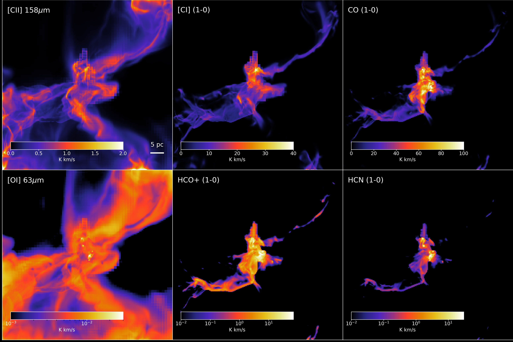

Gallery
=======

Velocity integrated emission maps of a star-forming region using **RT-synth**. The snapshot is the central sub-region taken from the SILCC-Zoom project (`Seifried et al., 2017 <https://ui.adsabs.harvard.edu/abs/2017MNRAS.472.4797S/abstract>`_) and it is modelled at a resolution of :math:`256^{3}` using the OpenMP version of 3D-PDR.

The top row shows the emission of [CII] 158μm, the [CI] (1-0) and the CO (1-0) lines, respectively. The colour bar in the top row is in linear scale. The bottom row shows the emission of [OI] 63μm, HCO+ (1-0) and HCN (1-0), respectively, with the colour bar in logarithmic scale.

