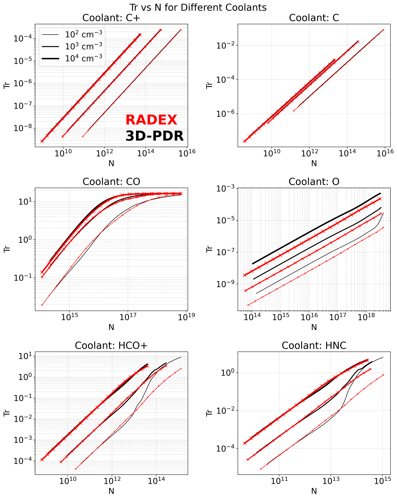

Comparison with RADEX
=====================

`RADEX <https://var.sron.nl/radex/radex.php>`_ (`van der Tak et al., 2007 <https://ui.adsabs.harvard.edu/abs/2007A%26A...468..627V/abstract>`_) is a popular algorithm that solves radiative transfer for given column density, H₂ number density, and gas temperature. Comparison of **RADEX** with **3D-PDR** and **RT-tool** is only valid for:

* Isothermal runs (thermal balance switched off)
* Uniform-density 1D clouds
* No external radiation field

**3D-PDR Setup for Comparison:**

1. Edit ``config.mk``: set ``GUESS_TEMP=0`` and ``THERMALBALANCE=0`` for 1D runs
2. Modify ``params.dat`` as appropriate. For instance:

   ::

      2)  1Dn43.dat                  !ICs file -- assuming you have already created it
      ...
      4)  radexcomp                  !Output prefix
      5)  0                          !G0 (no FUV)
      6)  1.0E-17                    !Cosmic-ray rate
      ...
      9)  1.0                        !Turbulent velocity
      ...
      23) 30.0                       !Gas temperature
      ...
      33) hco+.dat                   !HCO+ coolant -- e.g. if you want to include additional coolants

3. Run ``./3DPDR``

**RT-tool Setup for Comparison:**

1. Edit ``paramsRT.dat`` accordingly 
2. Run ``./RTtool``

**RADEX Setup for Comparison:**

.. The linewidth is given by:

   .. math::
      \Delta V = 2 \sqrt{2 \ln{2}}\sqrt{\frac{k_{\rm B}T_{\rm gas}}{m_{\rm mol}} + v_{\rm turb}^2}

1. Set the linewidth value to that of turbulent velocity used in 3D-PDR and RT-tool
2. Set the RADEX "escape probability" to ``LVG`` for consistency. 
3. Use as H2 number density and column density of the coolant, the values outputted by RT-tool.

.. note::
   
   Differences are expected since **3D-PDR** treats the cloud as 1D with depth-dependent level populations, while RADEX uses a 0D approach.

**Example**

The plot below shows a comparison between 3D-PDR & RT-tool (black lines) against RADEX (red lines). The comparison is done for three different uniform density models with :math:`10^2`, :math:`10^3`, and :math:`10^4` total H-nucleus number densities at a fixed gas temperature of :math:`T_{\rm gas}=20\,{\rm K}`. The radiation temperatures (Tr in K) of C+, [CI] (1-0), CO (1-0), [OI] 63μm, HCO+ (1-0) and HNC (1-0) versus the column density (N) of the corresponding coolant are shown. In general there is a broad agreement between the two codes. As noted above, the differences seen in e.g. HCO+ and HNC for low densities are potentially associated with differences in the treatment of level populations.

